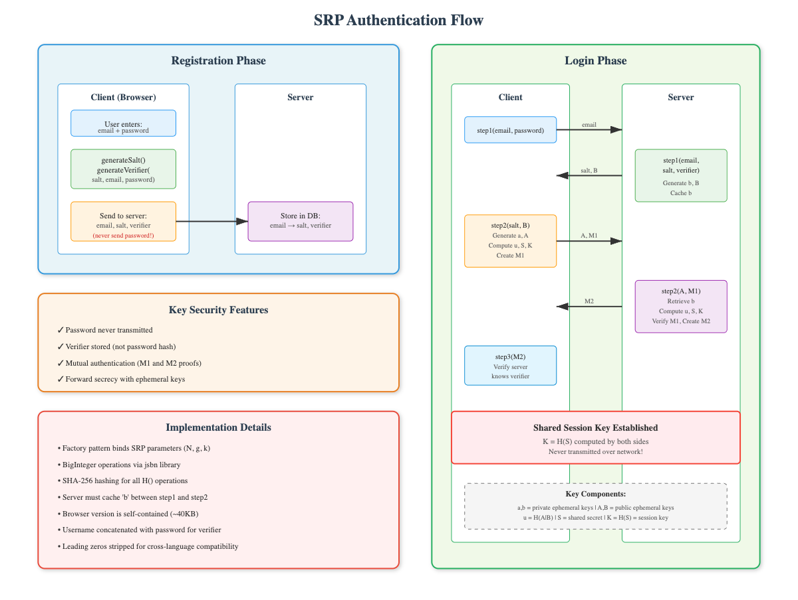
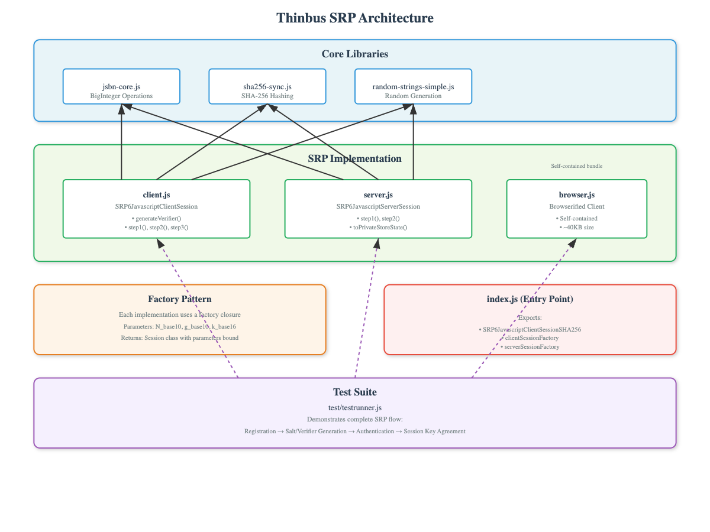

# Thinbus Javascript Secure Remote Password (SRP)

[](https://github.com/simbo1905/thinbus-srp-npm/actions/workflows/ci.yml)
[](https://badge.fury.io/js/thinbus-srp)

This repo provides a Javascript [Secure Remote Password](http://srp.stanford.edu/) [SRP-6a](http://srp.stanford.edu/doc.html#papers) implementation for web browsers to perform a zero-knowledge proof-of-password to a web server. It contains both client and server JavaScript code supporting both **ES modules** (.mjs) for modern environments and legacy CommonJS modules for backward compatibility.

The following diagram gives an overview of the protocol that is described in [RFC 2945](https://tools.ietf.org/html/rfc2945) and [RFC 5054](https://tools.ietf.org/html/rfc5054). This repository has a full end-to-end automation test suite demonstrating the working solution:

[](flow.html)

[RFC 5054](https://tools.ietf.org/html/rfc5054) provides test vectors to confirm the cryptography is correct. This repo has a unit test that confirms that we match the RFC test vectors which use sha1. The actual hash method is plugable and this repo defaults to sha256; you can plug in a stronger hash function if you wish.

## Quick Start

### ES Modules (Recommended - Modern Browsers & Node.js)

**Node.js Server Example:**
```javascript
import { createHash } from 'crypto';
import { fileURLToPath, pathToFileURL } from 'url';
import { dirname, join } from 'path';

// Inject crypto for Node.js
globalThis.nodeCrypto = { createHash };

// Get module paths
const __filename = fileURLToPath(import.meta.url);
const __dirname = dirname(__filename);

// Import ES modules
const clientModule = await import(pathToFileURL(join(__dirname, 'node_modules/thinbus-srp/client.mjs')).href);
const serverModule = await import(pathToFileURL(join(__dirname, 'node_modules/thinbus-srp/server.mjs')).href);

// RFC 5054 2048bit constants
const rfc5054 = {
    N_base10: "21766174458617435773191008891802753781907668374255538511144643224689886235383840957210909013086056401571399717235807266581649606472148410291413364152197364477180887395655483738115072677402235101762521901569820740293149529620419333266262073471054548368736039519702486226506248861060256971802984953561121442680157668000761429988222457090413873973970171927093992114751765168063614761119615476233422096442783117971236371647333871414335895773474667308967050807005509320424799678417036867928316761272274230314067548291133582479583061439577559347101961771406173684378522703483495337037655006751328447510550299250924469288819",
    g_base10: "2",
    k_base16: "5b9e8ef059c6b32ea59fc1d322d37f04aa30bae5aa9003b8321e21ddb04e300"
};

// Create session factories
const SRP6JavascriptClientSession = clientModule.default(rfc5054.N_base10, rfc5054.g_base10, rfc5054.k_base16);
const SRP6JavascriptServerSession = serverModule.default(rfc5054.N_base10, rfc5054.g_base10, rfc5054.k_base16);
```

**Browser Example:**
```html
<!-- Include CryptoJS for SHA256 support -->
<script src="https://cdnjs.cloudflare.com/ajax/libs/crypto-js/4.1.1/crypto-js.min.js"></script>

<script type="module">
// RFC 5054 2048bit constants
const rfc5054 = {
    N_base10: "21766174458617435773191008891802753781907668374255538511144643224689886235383840957210909013086056401571399717235807266581649606472148410291413364152197364477180887395655483738115072677402235101762521901569820740293149529620419333266262073471054548368736039519702486226506248861060256971802984953561121442680157668000761429988222457090413873973970171927093992114751765168063614761119615476233422096442783117971236371647333871414335895773474667308967050807005509320424799678417036867928316761272274230314067548291133582479583061439577559347101961771406173684378522703483495337037655006751328447510550299250924469288819",
    g_base10: "2",
    k_base16: "5b9e8ef059c6b32ea59fc1d322d37f04aa30bae5aa9003b8321e21ddb04e300"
};

// Import client module dynamically
import('/node_modules/thinbus-srp/client.mjs').then(clientModule => {
    const SRP6JavascriptClientSession = clientModule.default(rfc5054.N_base10, rfc5054.g_base10, rfc5054.k_base16);
    console.log('✅ SRP Client module loaded');

    // Your authentication logic here
});
</script>
```

### Legacy Browser Support

**For browsers that don't support ES modules** (Internet Explorer 11, Chrome < 61, Firefox < 60, Safari < 10.1, Edge < 16), you can build a legacy UMD bundle:

```bash
# Build legacy browser bundle (creates dist/thinbus-srp-legacy.js)
npm run build-legacy
```

Then use it in your HTML:

```html
<!DOCTYPE html>
<html>
<head>
    <!-- Include CryptoJS for SHA256 support -->
    <script src="https://cdnjs.cloudflare.com/ajax/libs/crypto-js/4.1.1/crypto-js.min.js"></script>

    <!-- Load the legacy UMD bundle -->
    <script src="dist/thinbus-srp-legacy.js"></script>
</head>
<body>
    <script>
        // RFC 5054 2048bit constants
        const rfc5054 = {
            N_base10: "21766174458617435773191008891802753781907668374255538511144643224689886235383840957210909013086056401571399717235807266581649606472148410291413364152197364477180887395655483738115072677402235101762521901569820740293149529620419333266262073471054548368736039519702486226506248861060256971802984953561121442680157668000761429988222457090413873973970171927093992114751765168063614761119615476233422096442783117971236371647333871414335895773474667308967050807005509320424799678417036867928316761272274230314067548291133582479583061439577559347101961771406173684378522703483495337037655006751328447510550299250924469288819",
            g_base10: "2",
            k_base16: "5b9e8ef059c6b32ea59fc1d322d37f04aa30bae5aa9003b8321e21ddb04e300"
        };

        // Create SRP client from UMD bundle
        const SRP6JavascriptClientSession = ThinbusSRP.default(rfc5054.N_base10, rfc5054.g_base10, rfc5054.k_base16);

        // Use exactly the same API as ES modules
        const client = new SRP6JavascriptClientSession();
        // ... rest of your authentication code
    </script>
</body>
</html>
```

**Browser Support:**
- **ES Modules Supported**: Chrome 61+, Firefox 60+, Safari 10.1+, Edge 16+ ([MDN Reference](https://developer.mozilla.org/en-US/docs/Web/JavaScript/Guide/Modules#browser_support))
- **Legacy Bundle Required**: Internet Explorer 11, Chrome < 61, Firefox < 60, Safari < 10.1, Edge < 16

See the working example in `e2e/public/legacy.html` and test it with:
```bash
npm run test:legacy:headed
```

**Note:** ES modules are the recommended approach for modern applications. Only use the legacy bundle for older browser support.

## Complete Usage Example

### Registration Flow

```javascript
// Client-side registration (browser or Node.js)
const client = new SRP6JavascriptClientSession();

// Generate salt and verifier for user registration
const salt = client.generateRandomSalt();
const username = "user@example.com";
const password = "strongPassword123";
const verifier = client.generateVerifier(salt, username, password);

// Send to server: { username, salt, verifier }
// ⚠️ NEVER send the raw password to the server!
console.log('Registration data:', { username, salt, verifier });
```

### Authentication Flow

**Client-side (Step 1 & 2):**
```javascript
const client = new SRP6JavascriptClientSession();

// Step 1: Initialize with credentials
client.step1(username, password);

// Get challenge from server (salt + B)
const response = await fetch('/auth/challenge', {
    method: 'POST',
    headers: { 'Content-Type': 'application/json' },
    body: JSON.stringify({ username })
});
const { salt, B } = await response.json();

// Step 2: Generate client proof
const credentials = client.step2(salt, B);
// credentials = { A: "...", M1: "..." }

// Send credentials to server
const authResponse = await fetch('/auth/verify', {
    method: 'POST',
    headers: { 'Content-Type': 'application/json' },
    body: JSON.stringify({ username, A: credentials.A, M1: credentials.M1 })
});

const { M2, success } = await authResponse.json();

if (success) {
    // Step 3: Verify server proof (optional)
    const verified = client.step3(M2);
    if (verified) {
        // Get shared session key for follow-on cryptography
        const sessionKey = client.getSessionKey();
        console.log('Authentication successful!', { sessionKey });
    }
}
```

**Server-side:**
```javascript
// Handle challenge request
app.post('/auth/challenge', async (req, res) => {
    const { username } = req.body;

    // Look up user's salt and verifier from database
    const user = await getUserFromDatabase(username);
    if (!user) {
        return res.status(404).json({ error: 'User not found' });
    }

    // Generate server challenge
    const server = new SRP6JavascriptServerSession();
    const B = server.step1(username, user.salt, user.verifier);

    // Store server private state in cache/session
    const privateState = server.toPrivateStoreState();
    await storeServerState(username, privateState);

    res.json({ salt: user.salt, B });
});

// Handle authentication verification
app.post('/auth/verify', async (req, res) => {
    const { username, A, M1 } = req.body;

    try {
        // Restore server state
        const privateState = await getServerState(username);
        const server = new SRP6JavascriptServerSession();
        server.fromPrivateStoreState(privateState);

        // Verify client proof and generate server proof
        const M2 = server.step2(A, M1);

        // Get shared session key
        const sessionKey = server.getSessionKey();

        res.json({ success: true, M2, sessionKey });
    } catch (error) {
        res.status(401).json({ error: 'Authentication failed' });
    }
});
```

## Running Tests and Examples

This package includes comprehensive End-to-End tests that demonstrate real-world usage:

```bash
# Run ES module tests
npm run test:esm

# Run E2E browser tests (requires Puppeteer)
npm run test:e2e:basic

# Run E2E tests with visible browser (for debugging)
npm run test:e2e:basic:headed

# Build ES modules from source
npm run build-es && npm run build-server

### Linting Markdown

To lint the markdown files in this project:

```bash
npx markdownlint-cli README.md
```

The E2E tests in `e2e/` directory provide complete working examples of:
- **Browser client implementation** (`e2e/public/app.js`)
- **Express server implementation** (`e2e/test-server.mjs`)
- **Full authentication flow** with real user registration and login

## Development

[](architecture.html)

The architecture diagram above shows how the core libraries (BigInteger operations, SHA-256 hashing, and secure random generation) are used by both client and server implementations through a factory pattern.

### Building ES Modules

The ES modules are built from source files using concatenation:

```bash
# Build client.mjs and server.mjs
npm run build-es
npm run build-server
```
### Project Structure

```
├── client-exports.js       # ES module client factory source
├── server-exports.js       # ES module server factory source
├── jsbn-core.js           # BigInteger arithmetic source
├── sha256-sync.js         # SHA-256 hashing source
├── random-strings-simple.js # Secure random generation source
├── browser.js             # Legacy browserify bundle
├── e2e/                   # End-to-End test examples
│   ├── public/app.js      # Browser client example
│   ├── test-server.mjs    # Express server example
│   └── tests/             # Puppeteer E2E tests
└── test/
    └── testrunner-esm.js  # ES module test runner
```

## Miscellaneous

The name Thinbus is a play on the name of the SRP Java library Nimbus. Thinbus NPM (this repo) is tested against Thinbus JavaSciprt taken from the Java version, which in turn is testing against Nimbus, which gives higher confidence in its correctneess. Nimbus has had a lot of eyes look at it over the years and was carefully check against other Java SRP library code and the example code provided by the inventor of SRP.

Thinbus aims to support different server languages. By providing server versions tested against Thinbus JavaScript which is tested against many servers we can collectively all have greater confidence that all the server versions are correct:

1. [thinbus-srp-js](https://bitbucket.org/simon_massey/thinbus-srp-js) The Java version which is compatible with the JavaScript version. At a future release I may delete the JavaScript from that repo and make this npm vesion the canonical one. It also includes a Java SRP client that you can use for server-to-server authentication or to generate temporary passwords to email to users.
1. [thinbus-srp-spring-demo](https://bitbucket.org/simon_massey/thinbus-srp-spring-demo/overview) A Spring MVC application which uses the Thinbus JavaScript library to create accounts and login users with Spring Security. This has both authentication and authorisation.
1. [thinbus-php](https://bitbucket.org/simon_massey/thinbus-php/overview) Uses the Thinbus Javascript library to do SRP authentication to PHP server code. It also includes a PHP SRP client that you can use for server-to-server authentication or to generating temporary passwords to email to users.
1. [pysrp_thinbus](https://github.com/SthPhoenix/pysrp_thinbus) is a fork of [pysrp](https://github.com/cocagne/pysrp) which is compatible with Thinbus so that you can use Python on the server.

## Detailed Explanation Of SRP

For the definitions of the values discussed below please refer to the [SRP design page](http://srp.stanford.edu/design.html). The following sequence diagram shows how to register a user with an SRP salt and verifier as demonstrated by the [Thinbus Demo Application](https://github.com/simbo1905/thinbus-srp-npm-tester).


In the diagram above the user is shown a standard registration form which includes both the username (e.g email) and password fields.
They enter their email and password and click the register button. JavaScript then generates their random `salt`
and with the salt, email and password generates an SRP `verififer`. Only the email, `salt` and the `verifier` are transmitted to
the server and the generated values are saved into the database keyed by the email.

**Note** Always use browser developer tools to inspect what you actually post to the server and only post the values shown
in the sequence diagram as defined in the [SRP design page](http://srp.stanford.edu/design.html). It is a protocol
violation and security bug if the raw password is accidently transmitted to the server even if it is ignored by the server. It is also a protocol violation and a security bug if you accidently transmit the verifier to the browser.

The following sequence diagram shows how to login a registered user.


In the diagram above the user is shown a standard login form. They enter their email and password and click the login button.
JavaScript then makes an AJAX call using their email to load their `salt` and a one-time server challenge `B`. Then client creates
a one-time client challenge `A` and uses all the information to compute a password proof `M1`. It then posts to the server
the email, `A`, and `M1` as the users credentials. The server uses all the information (including a private part of the challenge to check the password proof). Only the email,
client challenge `A` and the password proof `M1` are transmitted to the server. Note that the server needs to hold the private challenge state `b` that corresponds to the public challenge `B` sent to the client. It can store this private state in a time limited cache.

There is an optional step `client.step3(M2)` where `M2` is the server's proof of a shared session key to the client.
You can return `M2` from the server to check the browser has a matching shared secret if you wish to use that for further cryptography. If your web application is distributed as a native mobile application such that the client is running trusted JavaScript then the `M2` proof is an additional check of the authenticity of the server; it confirms to trusted client code that the server knows the verifier matching the user password. This check is also proof that the client and server both generated the same shared session key `S`. You can use `getSessionKey()` on the client and server to get `H(S)` a 256bit shared key that has not been transmitted over the network. This can be used for follow on cryptography such as [http-hmac-spec](https://github.com/acquia/http-hmac-spec/blob/2.0/README.md#spec) signing of restful API traffic.

**Note** that you don't have to use AJAX for SRP. It is used in the examples to hide the fact that with SRP you need an additional round-trip to the server to generate a challenge using the users verifier. You can avoid using AJAX by splitting the username and password fields across two pages. The first page can send the username and the next page can have a hidden fields containing the user specific salt and the server challenge `B`. This simply replaces the AJAX trip with an explicit page load.

**Note** as per RFC 2945 the user ID (usually their email) is concatenated to their password when generating the verifier. This means that if a user changes *either* their email address or their password you need to generate a new verifier and replace the old one in the database.

**Note** always use browser developer tools to inspect what you actually post to the server and only post the values shown
in the sequence diagram as defined in the [SRP design page](http://srp.stanford.edu/design.html). It is a protocol violation
and a security bug to accidently transmit to the server anything else even if it is ignored by the server.

**Note** the JavaScript client object (typically `SRP6JavascriptClientSession`) must be destroyed after each login attempt.
The object is intended to be a temporary object and should be deleted to erase all traces of the password. You must also destroy
the password form field the user typed their password into. The normal way to achieve destroying any traces of the password is to unload
the login page after every login attempt. This is trivial to do by reloading the login page upon authentication failure or by loading a main landing page upon successful login.

**Note** that the server has to remember the private ephemeral key `b` that matches the public ephemeral key `B` sent as a one-time server challenge to the user.
This requires storing `b` either in the database, the server session or a server cache for the short duration of the login protocol.
You cannot pass this value back to the server from the client without compromising security.
The server should not use any values transmitted from the client other than those shown in the sequence diagram and
named in the [SRP design page](http://srp.stanford.edu/design.html).

**Note** if you want to use the shared session key for follow-on cryptography you should use `client.getSessionKey()` to retrieved the
session key from the thinbus object and destroy the thinbus object as discussed above. The typical way to do this is to put the session key into browser local session storage. Then you can unload the login page then load a main landing page that collects the session key
from storage. You can for example use the shared key for [http-hmac-spec](https://github.com/acquia/http-hmac-spec/blob/2.0/README.md#spec) signing for restful API traffic.

### Standards Compliance and Hash Upgrades for 2020s

This implementation follows established SRP standards with modern hash algorithms:

**RFC Compliance:**
- **[RFC 5054](https://tools.ietf.org/html/rfc5054)** (2007): SRP-6a authentication mechanism using the 2048-bit safe prime from Appendix A. Our test vectors and default constants match this specification.
- **[RFC 2945](https://tools.ietf.org/html/rfc2945)** (2000): We follow the robust approach of mixing the user identifier (email/username) with the password during verifier generation, preventing username enumeration attacks.

**Hash Algorithm Upgrades:**
- **SHA-256 by default**: While the original RFCs specified SHA-1 (RFC 2945 from 2000, RFC 5054 from 2007), SHA-1 became cryptographically compromised by 2017. We've upgraded to SHA-256 for all hash operations.
- **Future-proof design**: The hash algorithm is configurable and can be upgraded as cryptographic standards evolve.

**Password Stretching Compatibility:**
Since only the client handles the raw password, users of this library are free to apply their own password stretching algorithms (PBKDF2, scrypt, Argon2) to the password before passing it to the SRP client. This makes systems more resilient to brute force attacks:

```javascript
// Example with PBKDF2 password stretching
import { pbkdf2Sync } from 'crypto';

const stretchedPassword = pbkdf2Sync(rawPassword, userSalt, 100000, 32, 'sha256').toString('hex');
const client = new SRP6JavascriptClientSession();
client.step1(username, stretchedPassword); // Use stretched password
```

### Creating A Custom Large Safe Prime

The Java version of Thinbus has a command line tool and instructions how to use openssl to create safe prime see https://bitbucket.org/simon_massey/thinbus-srp-js/overview

### Recommendations

- Use Thinbus SRP over HTTPS. Configure your webserver to mark session cookies as secure to prevent accidental use of HTTP.  Configure [HSTS](https://en.wikipedia.org/wiki/HTTP_Strict_Transport_Security#HSTS_mechanism_overview) to force HTTPS with your service. If your customers use a company supplied computer going via a corporate web proxy then HTTPS may be [decrypted and monitored](http://security.stackexchange.com/questions/63304/how-can-my-employer-be-a-man-in-the-middle-when-i-connect-to-gmail). HTTPS may be compromised due to things like [bad certs in the wild](http://nakedsecurity.sophos.com/2013/12/09/serious-security-google-finds-fake-but-trusted-ssl-certificates-for-its-domains-made-in-france/). HTTPS may be compromised by bugs or misconfigurations such as [Heartbleed](http://en.wikipedia.org/wiki/Heartbleed). HTTPS alone cannot protected against leaking passwords into error messages in your webserver logs. SRP over HTTPS is much safer than either used alone.
- Add a javascript password strength meter and only allow users to register a verifier for a strong password. The best cryptography in the world won't protect your users if they use "password" as their password.
- Check that the user isn't using a password that is in the [HiBP](https://haveibeenpwned.com/Passwords) database. HiBP lets you query using the first few characters of the hash of the users passwords. You can check for an exact match of the hash in the results and refuse to let the user use a password that is in the public database of leaked passwords.
- Use a custom large safe prime number `N` using the instructions above. **Tip:** Check on the browsers and hardware you are targeting that the math runs fast enough for a good user experience for your chosen bit length.
- Make the salt column in the database `not null` and add a uniqueness constraint.
- Use symmetric AES encryption with a key only visible at the webserver to encrypt the verifier `v` value within the database. This protects against off-site database backups being used in an offline dictionary attack against `v`.
- You can prevent privileged accounts from logging in using legacy browsers by checking `random16byteHex.isWebCryptoAPI()` when fetching the user salt; simply abort the protocol for privileged accounts when secure random numbers are not available at the browser. If you allow the use of browsers that don't have the `WebCryptoAPI` secure random number APIs then the fallback random generator hashes `window.cookie` as part of the generator seed. Consider adding a secure random cookie to help seed the fallback generator.
- Don't include any JS files [or any CSS files](http://stackoverflow.com/a/3613162/329496) from external sites onto your login page.
- Count the number of failed password attempts and present the user with a CAPTCHA after a dozen attempts. This slows down scripted online dictionary attacks. Consider suspending the account (possibly temporarily) after a large number of contiguous failed attempts to defeat someone carefully researching a user then trying to guess their likely password.

## License

SPDX-FileCopyrightText: 2014-2025 Simon Massey
SPDX-License-Identifier: Apache-2.0
